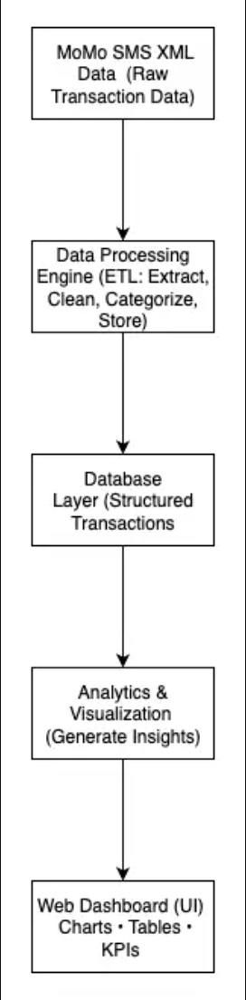
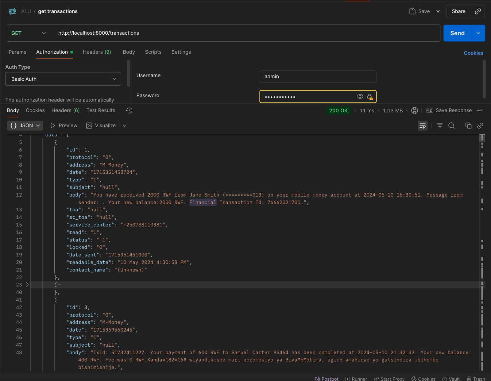
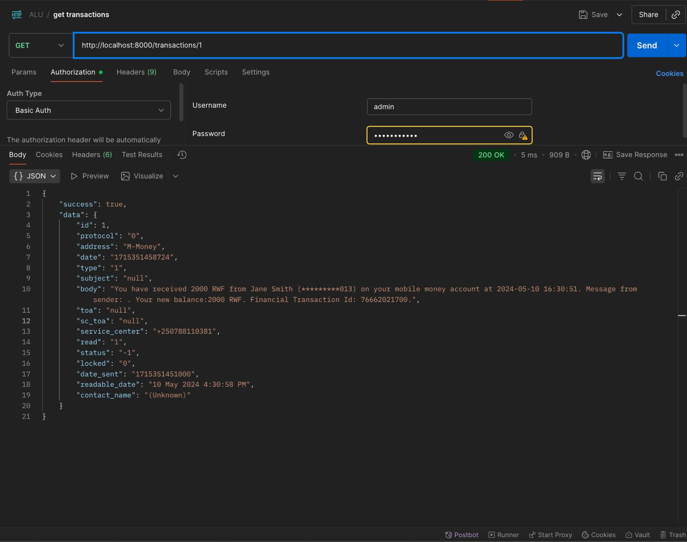
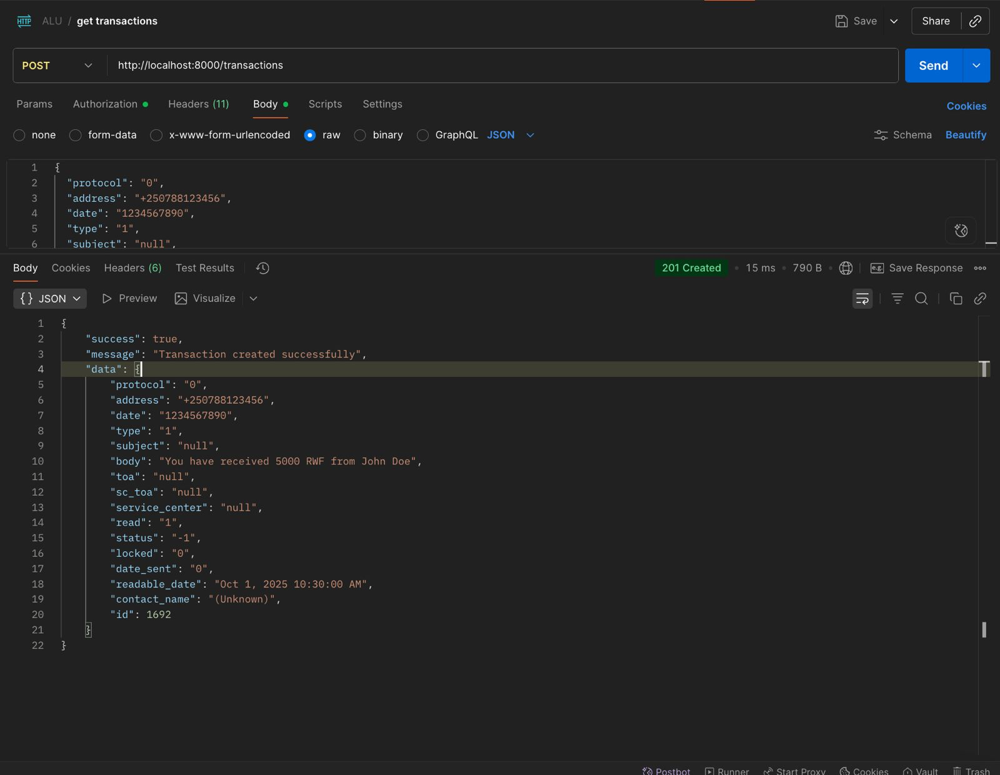
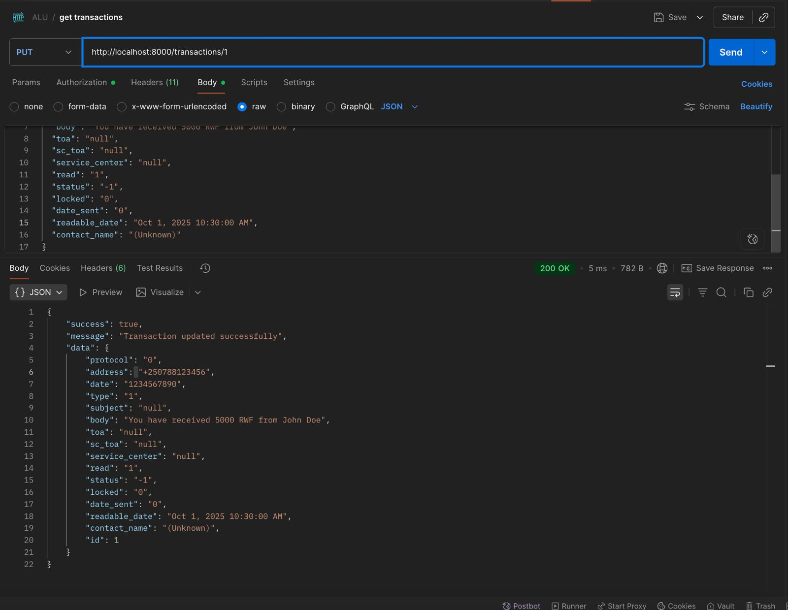
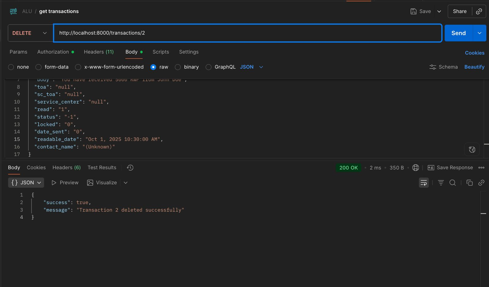

# MoMo Transaction API 

## Team 10
## Team Members  
- Belyse Kalisa Teta Yamwakate 
- Seth Abijuru
- Chukwuemeka Onugha

---

## Project Description  
This project processes **MoMo SMS transaction data** in XML format, cleans and categorizes it, stores it in a relational database, and provides a **web-based dashboard** to analyze and visualize transaction insights.  

---

## System Architecture  
We use an **ETL pipeline** to extract, transform, and load data into a database. The cleaned data is then used to generate analytics and visualizations on a simple dashboard.

**Architecture Diagram:**  
[🔗 View Diagram](<https://drive.google.com/file/d/13LnY_zU2YuJpSjdtIuyehOeo5_XLI9GL/view?usp=sharing>)



---

## Scrum Board  
We are following **Agile** practices to organize and manage tasks using a Scrum board.

**Scrum Board Link:**  
[🔗 View Scrum Board](https://trello.com/b/f0gOBwrt/my-trello-board)


# 🗄️ Database Documentation
Our database is structured to capture **users, their phone numbers, MoMo transactions, transaction categories, and system logs**. This separation of entities ensures data normalization, avoids redundancy, and maintains consistency when processing large volumes of transactions. For instance:

- **Users and Phones** are separated into `USERS` and `USER_PHONES` tables because a user may have multiple phone numbers.  
- **Transactions** are stored in the `TRANSACTIONS` table, with foreign keys referencing both the **sender** and **receiver**.  
- **Categories** are stored in `TRANSACTION_CATEGORIES` to allow flexible classification of transactions (e.g., airtime, bill payment, transfer).  
- **Logs** are captured in `SYSTEM_LOGS` to track processing history.  
---

## Data Dictionary  

### USERS
| Column       | Type         | Description                     |
|--------------|-------------|---------------------------------|
| user_id (PK) | INT AUTO     | Unique identifier for a user    |
| user_name    | VARCHAR(100) | Name of the user                |
| email        | VARCHAR(150) | User email (optional)           |
| created_at   | TIMESTAMP    | Account creation timestamp      |

### USER_PHONES
| Column             | Type         | Description                                |
|--------------------|-------------|--------------------------------------------|
| phone_id (PK)      | INT AUTO     | Unique identifier for a phone record       |
| user_id (FK)       | INT          | References USERS(user_id)                  |
| phone_number       | VARCHAR(20)  | Phone number linked to the user            |

### TRANSACTION_CATEGORIES
| Column             | Type         | Description                                |
|--------------------|-------------|--------------------------------------------|
| category_id (PK)   | INT AUTO     | Unique identifier for category             |
| category_name      | VARCHAR(50)  | Name of category (e.g., Transfer, Airtime) |
| description        | TEXT         | Additional details about the category      |

### TRANSACTIONS
| Column             | Type         | Description                                |
|--------------------|-------------|--------------------------------------------|
| transaction_id (PK)| INT AUTO     | Unique identifier for a transaction        |
| amount             | DECIMAL(10,2)| Amount transacted                          |
| transaction_date   | TIMESTAMP    | Date and time of transaction               |
| sender_id (FK)     | INT          | References USERS(user_id) – sender         |
| receiver_id (FK)   | INT          | References USERS(user_id) – receiver       |
| category_id (FK)   | INT          | References TRANSACTION_CATEGORIES          |

### SYSTEM_LOGS
| Column             | Type         | Description                                |
|--------------------|-------------|--------------------------------------------|
| log_id (PK)        | INT AUTO     | Unique identifier for a log                |
| log_message        | TEXT         | Description of the processing step         |
| log_stamp          | TIMESTAMP    | When the log entry was created             |

---

## SQL → JSON Mapping  

| **SQL Table.Column**                   | **JSON Field**                  |
| -------------------------------------- | ------------------------------- |
| `USERS.user_id`                        | `user.user_id`                  |
| `USERS.user_name`                      | `user.user_name`                |
| `USERS.email`                          | `user.email`                    |
| `USERS.created_at`                     | `user.created_at`               |
| `USER_PHONES.phone_number`             | `user.phones[]`                 |
| `TRANSACTIONS.transaction_id`          | `transaction.transaction_id`    |
| `TRANSACTIONS.amount`                  | `transaction.amount`            |
| `TRANSACTIONS.transaction_date`        | `transaction.transaction_date`  |
| `TRANSACTIONS.sender_id`               | `sender.user_id`                |
| `TRANSACTIONS.receiver_id`             | `receiver.user_id`              |
| `TRANSACTIONS.category_id`             | `category.category_id`          |
| `TRANSACTION_CATEGORIES.category_name` | `category.category_name`        |
| `TRANSACTION_CATEGORIES.description`   | `category.description`          |
| `SYSTEM_LOGS.log_id`                   | `processing_logs[].log_id`      |
| `SYSTEM_LOGS.log_message`              | `processing_logs[].log_message` |
| `SYSTEM_LOGS.log_stamp`                | `processing_logs[].log_stamp`   |


REFLECTION 

Reflection on Search Performance

Linear search checks each element one by one, so the time grows with the number of records (O(n)). 
Dictionary lookup uses a hash table, so it can jump directly to the element’s memory address, making 
it average O(1) time. This explains why dictionary lookups are much faster than linear search, especially 
as the dataset grows.

Another data structure we could use is a Binary Search Tree (BST). If the dataset is sorted by ID, 
we can apply binary search with O(log n) time complexity, which is more efficient than linear search 
but not as fast as hash maps (dict). Hash maps remain the most practical choice for quick lookups.


# MoMo SMS REST API

## Overview
A secure REST API for managing mobile money SMS transaction records. This system parses XML data, provides CRUD operations, implements Basic Authentication, and demonstrates DSA efficiency comparisons.

## Project Structure
```
alu-momo-sms-data-processing-system/
├── api/                    # API implementation
│   └── server.py          # Main API server
├── dsa/                   # Data Structures & Algorithms
│   └── search_comparison.py
├── docs/                  # Documentation
│   └── api_docs.md       # API endpoint documentation
├── screenshots/           # Test case screenshots
│   ├── get_all.png
│   ├── get_one.png
│   ├── post_create.png
│   ├── put_update.png
│   ├── delete.png
│   └── unauthorized.png
├── data/
│   └── modified_sms_v2.xml
└── README.md
```

## Prerequisites
- Python 3.8 or higher
- No external libraries required (uses standard library only)
- curl or Postman for testing

## Installation & Setup

### 1. Clone the Repository
```bash
git clone https://github.com/kbelyse/alu-momo-sms-data-processing-system-team-10.git
cd alu-momo-sms-data-processing-team-10
```

### 2. Verify Python Installation
```bash
python3 --version
```

### 3. Start the API Server
```bash
cd api
python3 server.py
```

The server will start on `http://localhost:8000`

You should see:
```
Server starting on http://localhost:8000
Press Ctrl+C to stop the server
```

## Authentication
The API uses Basic Authentication with the following credentials:
- **Username:** `admin`
- **Password:** `password` (hidden in screenshots as dots)

## API Endpoints

### 1. GET /transactions
Retrieve all transactions

**curl Example:**
```bash
curl -u admin:password http://localhost:8000/transactions
```

**Expected Response:** `200 OK` with JSON array of all transactions



---

### 2. GET /transactions/{id}
Retrieve a specific transaction by ID

**curl Example:**
```bash
curl -u admin:password http://localhost:8000/transactions/1
```

**Expected Response:** `200 OK` with single transaction object



---

### 3. POST /transactions
Create a new transaction

**curl Example:**
```bash
curl -X POST -u admin:password \
  -H "Content-Type: application/json" \
  -d '{
    "protocol": "0",
    "address": "+250788123456",
    "date": "1234567890",
    "type": "1",
    "subject": "null"
  }' \
  http://localhost:8000/transactions
```

**Expected Response:** `201 Created` with the new transaction object



---

### 4. PUT /transactions/{id}
Update an existing transaction

**curl Example:**
```bash
curl -X PUT -u admin:password \
  -H "Content-Type: application/json" \
  -d '{
    "body": "You have received 5000 RWF from John Doe",
    "toa": "null",
    "sc_toa": "null",
    "service_center": "null",
    "read": "1",
    "status": "-1",
    "locked": "0",
    "date_sent": "0",
    "readable_date": "Oct 1, 2025 10:30:00 AM",
    "contact_name": "(Unknown)"
  }' \
  http://localhost:8000/transactions/1
```

**Expected Response:** `200 OK` with updated transaction object



---

### 5. DELETE /transactions/{id}
Delete a transaction

**curl Example:**
```bash
curl -X DELETE -u admin:password \
  http://localhost:8000/transactions/2
```

**Expected Response:** `200 OK` with success message



---

### Unauthorized Access
Attempting to access without credentials or with wrong credentials:

**curl Example:**
```bash
curl http://localhost:8000/transactions
```

**Expected Response:** `401 Unauthorized`

## Testing with Postman

### Setup Authentication in Postman:
1. Open Postman
2. Create a new request
3. Go to the **Authorization** tab
4. Select **Type:** Basic Auth
5. Enter:
   - Username: `admin`
   - Password: `password`

### Test Each Endpoint:
1. **GET All:** Set method to GET, URL to `http://localhost:8000/transactions`
2. **GET One:** Set method to GET, URL to `http://localhost:8000/transactions/1`
3. **POST:** Set method to POST, add JSON body in Body → raw → JSON
4. **PUT:** Set method to PUT, add JSON body
5. **DELETE:** Set method to DELETE, URL with specific ID

## DSA Performance Testing

Run the search comparison:
```bash
cd dsa
python3 search_comparison.py
```

This will:
- Compare Linear Search vs Dictionary Lookup
- Test with 20+ transaction records
- Display execution times for both methods
- Show efficiency differences

**Expected Output:**
```
=== Search Performance Comparison ===
Dataset size: 20 records

Linear Search Time: 0.000123 seconds
Dictionary Lookup Time: 0.000008 seconds

Dictionary lookup is 15.4x faster than linear search
```

## Troubleshooting

### Port Already in Use
If port 8000 is busy:
```bash
# Find process using port 8000
lsof -i :8000

# Kill the process
kill -9 <PID>

# Or change port in server.py
```

### XML File Not Found
Ensure `modified_sms_v2.xml` is in the `data/` directory

### Authentication Fails
- Verify username is `admin`
- Verify password is `password`
- Check for typos in credentials

## API Response Formats

### Success Response (200 OK):
```json
{
  "success": true,
  "data": { ... }
}
```

### Error Response (401 Unauthorized):
```json
{
  "success": false,
  "error": "Unauthorized"
}
```

### Error Response (404 Not Found):
```json
{
  "success": false,
  "error": "Transaction not found"
}
```

## Security Notes
**This implementation uses Basic Authentication for demonstration purposes only.**

**Limitations:**
- Credentials sent in Base64 encoding (easily decoded)
- No encryption without HTTPS
- Vulnerable to man-in-the-middle attacks
- Single set of hardcoded credentials


## Support
For issues or questions, please open an issue on GitHub:
https://github.com/kbelyse/alu-momo-sms-data-processing-system-team-10.git
